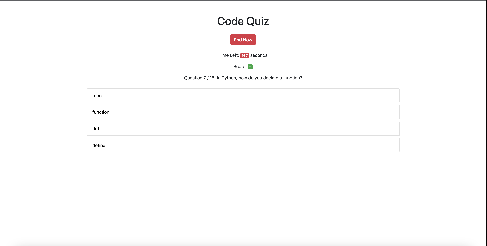
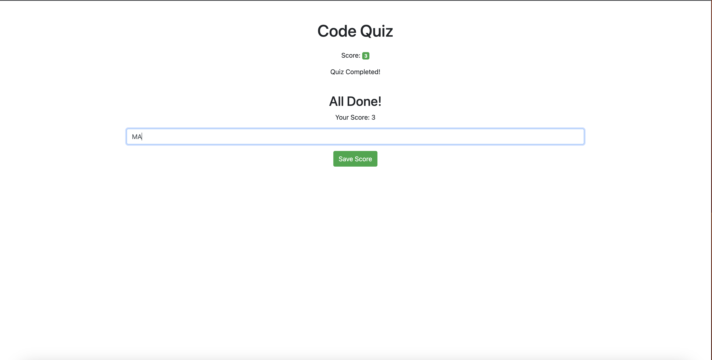
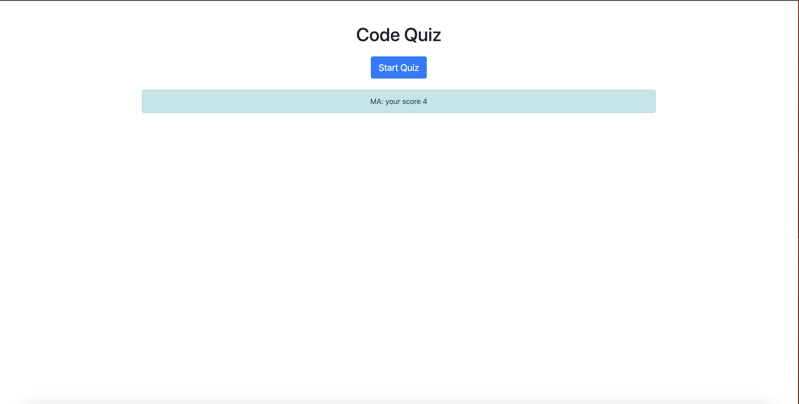

# 04 Web APIs: Code Quiz

# Build a timed coding quiz with multiple-choice questions.

## Description

Build a timed coding quiz with multiple-choice questions.

This app will run in the browser and will feature dynamically updated HTML and CSS powered by JavaScript code to start a timed coding quiz with multiple-choice questions and stores the user high score.

## Installation

1-Get and Define the Elements will be used.
2-Define Quistions Array.
3-start Quiz EventListener button to Execute:
-The Qize Timer function to update timeLeft, display it and end the quiz when the time done.
-Display Question Quiz function to display the quiz question, display answers options, add addEventListener on answers options to checkAnswers using checkAnswers function and execute endQuiz function to end the quiz when the quistions done.
-Display End Button to end the quiz at anytime.
4-After the quiz done by finish quistions on time or time done or click on end quiz button at anytime, execute saveScore function to get user initials and save to local storege with the score and reload the page.

## Usage

Included screenshots shows the usage and the deployed URL.

[Coding quiz URL]()
